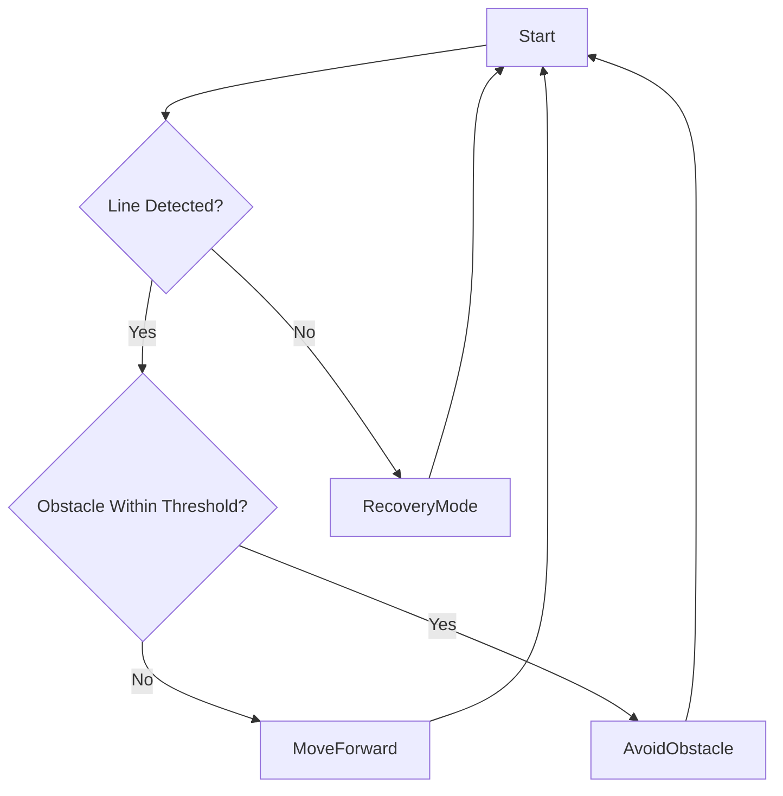

# Line Following & Object Avoidance Robot

**Project for ECE357, Shiv Nadar University**

## Overview

This project implements an autonomous mobile robot in Embedded C capable of following a predefined line, detecting obstacles, and executing avoidance maneuvers. The system demonstrates real-time control, sensor integration, and modular software architecture on an Arduino platform.

## Academic Context

* **Course:** ECE357 – Embedded Systems and Applications
* **Institution:** Shiv Nadar University
* **Objective:** Apply principles of embedded programming, sensor fusion, and control logic to design a reliable line-following and obstacle-avoiding robot.

## Core Functionality

1. **Line Tracking**

   * Uses an infrared sensor array (2- or 3-channel) to detect and follow black tape on the ground.

2. **Obstacle Detection**

   * Employs an HC-SR04 ultrasonic sensor for distance measurements up to 4 meters.

3. **Collision Avoidance**

   * Implements decision logic to stop, change direction, and resume line tracking when an obstacle is within a predefined threshold.

4. **Real-Time Control**

   * Executes a continuous control loop (`while(1)`) in Embedded C to achieve sub-millisecond response times.

## Hardware Components

| Component                   | Specification / Notes                                         |
| --------------------------- | ------------------------------------------------------------- |
| Arduino Uno (or equivalent) | Provides control logic and I/O interfaces.                    |
| IR Line Sensor Array        | 2- or 3-channel module for robust edge detection.             |
| HC-SR04 Ultrasonic Sensor   | Ultrasonic rangefinder for obstacle detection.                |
| DC Motors with Wheels (×4)  | Rear motors daisy-chained to front for synchronized movement. |
| Power Supply (Battery Pack) | 7.4 V LiPo recommended to separate logic and motor power.     |
| Chassis Kit                 | Adjustable frame for sensor and component mounting.           |

> **Design Note:** Although the Arduino was capable of directly driving the motors, it is strongly recommended to use a dedicated motor driver (e.g., L298N) and an independent power source for the motors. This configuration prevents voltage drops and protects the microcontroller from brownouts.

## Software Architecture

* **Language:** Embedded C (Arduino-compatible)
* **Structure:** Modular design with separate files for sensing, actuation, and control logic.
* **Main Loop:** Implements the sequence “sense → decide → act” with minimal overhead.

### Module Breakdown

| Module           | Description                                      |
| ---------------- | ------------------------------------------------ |
| `line_tracker.c` | Reads IR sensors, computes deviation from line.  |
| `ultrasonic.c`   | Triggers ultrasonic pulses, measures echo time.  |
| `motor_ctrl.c`   | Generates PWM signals, controls motor direction. |
| `main.c`         | Initializes hardware, manages the control loop.  |

## Behavior Flowchart

